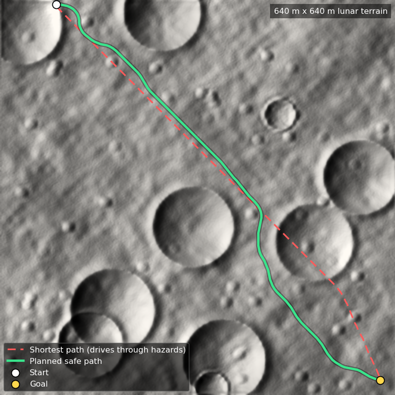
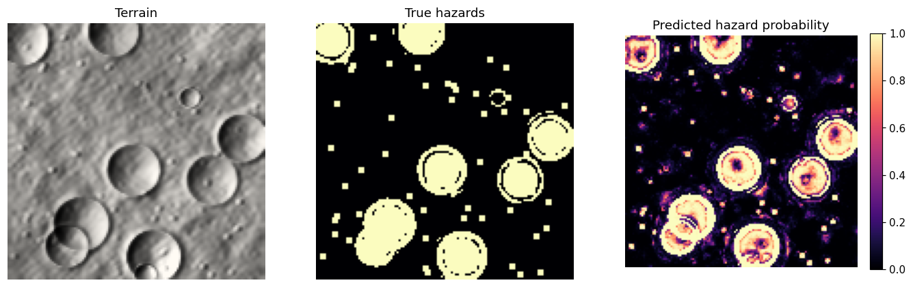

# Lunar Path Determination

Hazard-aware path planning for a lunar rover. A machine learning model reads the terrain and
predicts where it is unsafe to drive (crater walls, boulders, steep slopes), and an A* planner
finds the route that avoids those hazards while staying as short as possible.



## Results

Benchmarked on 20 terrains the model never saw during training (`outputs/metrics.json`):

| | Shortest path | Planned safe path |
|---|---|---|
| Hazard cells crossed (avg) | 29.1 | **0.3** |
| Maximum slope (avg) | 35.4° | **11.9°** |
| Route length (avg) | 834 m | 958 m (+14.9%) |

A safe path was found on all 20 maps. The rover travels about 15% further and in exchange
avoids almost every hazard and keeps slopes well below the 25° limit.

Hazard model on unseen terrain: **precision 0.91, recall 0.86, F1 0.88, ROC-AUC 0.98**.



## How it works

1. **Terrain** (`lunar/terrain.py`): generates a 128 × 128 elevation map at 5 m per cell
   (640 m × 640 m) with rolling hills, craters with raised rims and boulders. Real DEMs such as
   NASA LRO LOLA data can be loaded with `load_dem`.
2. **Features** (`lunar/features.py`): for every cell, computes slope, roughness, curvature,
   local relief, topographic position index and the steepest nearby slope.
3. **Hazard model** (`lunar/hazard_model.py`): a Random Forest trained on 8 terrains predicts the
   probability that each cell is hazardous. It is evaluated on separate terrains.
4. **Cost map and planner** (`lunar/planner.py`): each cell gets a travel cost from its slope and
   hazard probability; cells steeper than 25° or with hazard probability above 0.8 are blocked.
   A* with a straight-line heuristic finds the lowest-cost route. The heuristic never
   overestimates (all costs are at least 1), so the route is optimal for the cost map.
5. **API** (`api/main.py`): a FastAPI endpoint returns the planned path and its metrics.

## Run it

```bash
pip install -r requirements.txt
python scripts/run_demo.py        # trains model, benchmarks, saves figures to outputs/
pytest -q                         # 7 tests
uvicorn api.main:app --reload     # API docs at http://127.0.0.1:8000/docs
```

Example request:

```bash
curl -X POST http://127.0.0.1:8000/plan -H "Content-Type: application/json" \
  -d '{"seed": 42, "start": [4, 4], "goal": [123, 123]}'
```

Or with Docker: `docker build -t lunar-path . && docker run -p 8000:8000 lunar-path`

## Tech

Python, NumPy, SciPy, scikit-learn, Matplotlib, FastAPI, pytest, Docker, GitHub Actions.

## Next steps

- Train and test on real LOLA elevation tiles of the lunar south pole.
- Add an energy model (uphill driving costs more battery than flat ground).
- Replace the Random Forest with a small CNN over terrain patches and compare.
